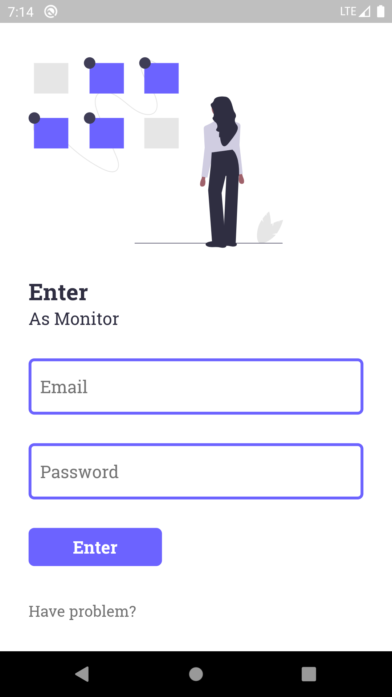
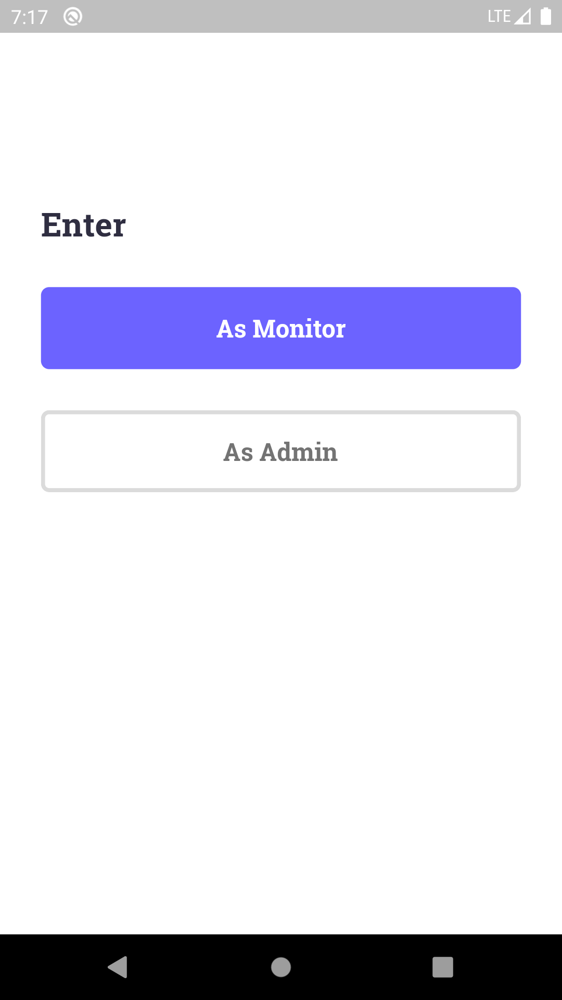
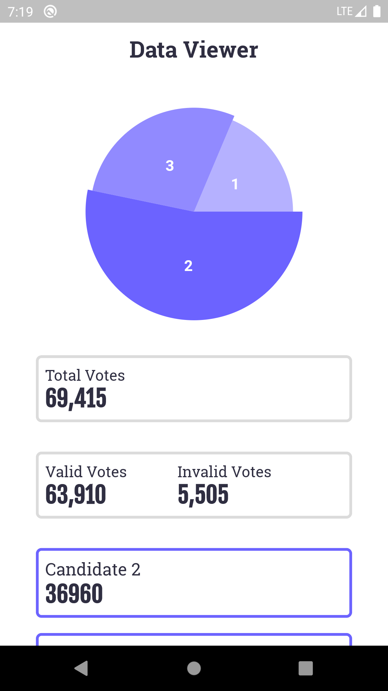

# Pemilu App

Pemilu App is prototype app for election monitor and input data built by Flutter

## Inside the app

- [Google Font](https://pub.dev/packages/google_fonts)
- [FL Chart](https://pub.dev/packages/fl_chart)
- [RX Dart](https://pub.dev/packages/rxdart)
- [Get It](https://pub.dev/packages/get_it)
- [Sub-district API](https://dev.farizdotid.com/api/daerahindonesia)
- Firebase: Firestore and Authentication

## Screenshots

